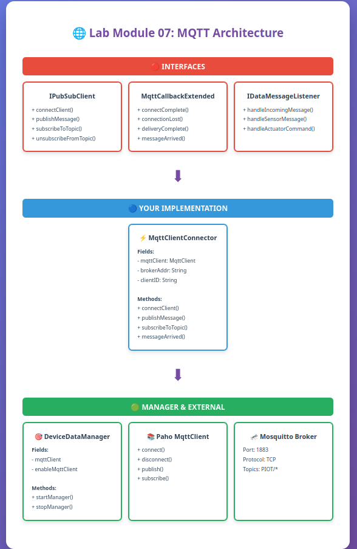

## Lab Module 07

### Description

#### What does your implementation do?
My implementation creates an MQTT Client for the Gateway Device Application (GDA) using the Eclipse Paho Library. The `MqttClientConnector` class implements `IPubSubClient` and `MqttCallbackExtended` interfaces to provide connection management, message publishing, and topic subscription capabilities.

#### How does your implementation work?
The `MqttClientConnector` uses the Paho MQTT Library to connect to a Mosquitto broker on `localhost:1883`. Configuration parameters are loaded from `PiotConfig.props` including broker address, port, and keep-alive settings. When `DeviceDataManager` starts, it creates the MQTT client, connects to the broker, and subscribes to relevant topics for device communication.

### Code Repository and Branch

**URL:** https://github.com/your-username/gda-java-components/tree/labmodule07

### UML Design Diagram(s)

### Unit Tests Executed

- `ConfigUtilTest`
- `SystemPerformanceManagerTest`
- `ActuatorDataTest`
- `SensorDataTest`
- `SystemPerformanceDataTest`

### Integration Tests Executed

- `MqttClientConnectorTest.testConnectAndDisconnect()`
  - Successfully connected and disconnected from broker
  
- `MqttClientConnectorTest.testPublishAndSubscribe()`
  - Successfully subscribed to 4 topics, published 3 messages, received all messages, and unsubscribed

