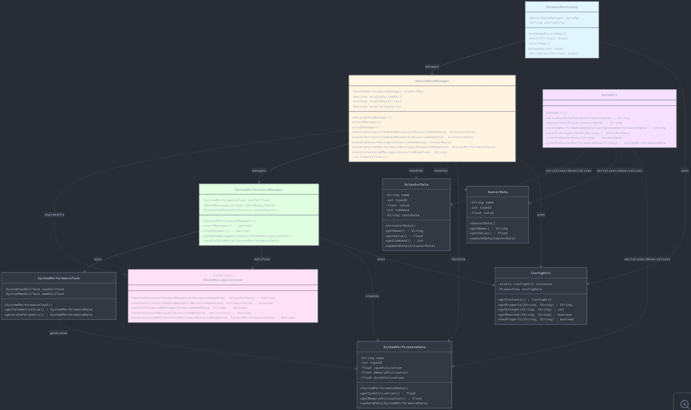

# Lab 11: Cloud Integration with MQTT and CoAP

## Description

My implementation for Lab 11 enables the Gateway Device Application (GDA) to integrate with cloud services using MQTT and CoAP protocols. The system publishes telemetry data (sensor readings and system performance metrics) to a cloud broker, while also subscribing to actuator command topics. This allows the GDA to receive commands from the cloud and trigger local actuation events in real time. The design supports event-driven communication, ensuring that IoT devices can both send data upstream and respond to downstream instructions seamlessly.

The implementation works by extending the existing GDA framework with cloud connectors (`MqttClientConnector`, `CloudClientConnector`, and `CoapClientConnector`). The `DeviceDataManager` coordinates data flow and implements `handleIncomingMessage()` to process incoming JSON payloads from the cloud. These payloads are converted into `ActuatorData` objects using `DataUtil`, validated, and then published back to the broker or acted upon locally. System performance tasks (CPU, memory, disk utilization) are scheduled and reported to the cloud, while sensor data is simulated and transmitted. Together, these components demonstrate secure, bidirectional IoT communication with the cloud.

## Code Repository and Branch

- GitHub URL: [https://github.com/empress-t-png/gda-java-components](https://github.com/empress-t-png/gda-java-components)
- Branch: `default`

## UML Design Diagrams

### Class Diagram

*Shows relationships between `DeviceDataManager`, `CloudClientConnector`, and `MqttClientConnector`. Highlights method responsibilities and connector interactions.*

## Unit Tests Executed

- `ConfigUtilTest`
- `DataUtilTest`
- `ActuatorDataTest`
- `SensorDataTest`
- `SystemPerformanceDataTest`

